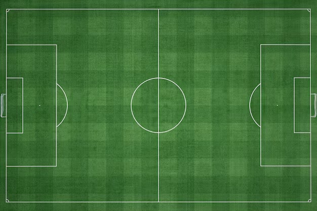

# Grocery Management System

A Python-based grocery store management application designed as a 3-tier system with a front end, backend, and database. This project enables efficient management of products and orders with an intuitive interface and robust backend functionality.

## Table of Contents
- [Features](#features)
- [Technologies Used](#technologies-used)
- [Installation](#installation)
- [Usage](#usage)
- [TODO](#todo)
- [License](#license)
### 1. Index Page

The index page lists all the orders placed with options to view or delete an order.

### 2. Manage Products

The manage products page allows you to add, edit, or delete products.

### 3. Add Product

The manage products page allows you to add a new product.

### 4. New Order Screen

The new order



4. Install dependencies:
    ```bash
    pip install -r requirements.txt